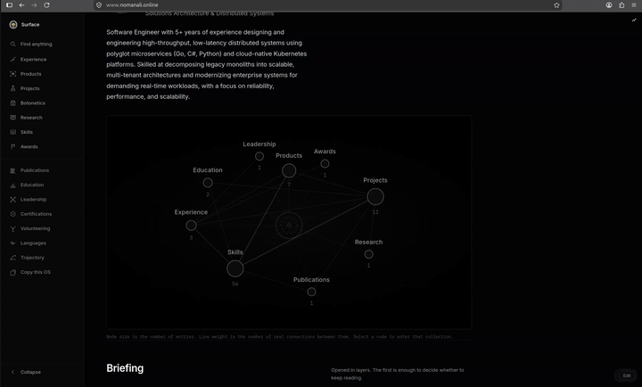

# Portfolio OS

**A portfolio framework for engineers whose work does not fit on a resume.**

> Fork it. Replace one JSON file. Deploy. It's yours.

🔗 **[Live Demo → nomanali.online](https://nomanali.online/)**



---

## ✨ Why Portfolio OS?

Most portfolio templates are a single long page with sections. This is not that — it's a **full content system** that makes your engineering work navigable at any depth.

| Feature | Description |
|---|---|
| 🗂️ **16 Collections** | Products, projects, research, publications, skills, experience, awards, certifications, education, leadership, and more |
| 🔗 **Relationship Graph** | Entities reference each other — skills link to products, projects link to research. An interactive knowledge graph visualises all connections |
| ✏️ **Built-in Editor** | Browser-based visual editor with undo, diff, and JSON export — no CMS, no server, no login required |
| 🔍 **Full-Text Search** | Command palette (`⌘/Ctrl + K`) searches across all entities instantly |
| 📊 **Private Analytics** | Zero-cookie, first-party analytics dashboard with heatmaps, device breakdowns, and session tracking |
| 🎨 **Two-Colour Theming** | Change two colour values and the entire UI re-skins coherently using OKLCH colour math |
| 📱 **Fully Responsive** | Optimised for desktop, tablet, and mobile |
| ⚡ **Static Generation** | Every entity page is pre-rendered at build time — fast, SEO-friendly, deployable anywhere |

---

## 🚀 Quickstart — Make It Yours in 3 Steps

### Step 1: Clone & Run

```bash
git clone https://github.com/nomi181472/portfolio-os.git my-portfolio
cd my-portfolio/portfolio-os
npm install
npm run dev
```

Open [http://localhost:3000](http://localhost:3000) — you'll see the demo portfolio running locally.

### Step 2: Replace Your Content

Everything about *you* lives in a single file: **`content/portfolio.json`**

You have two ways to edit it:

**Option A — Visual Editor (Recommended for getting started)**
1. Navigate to [http://localhost:3000/edit](http://localhost:3000/edit) (or press `⌘/Ctrl + E`)
2. Add your products, projects, experience, skills, etc.
3. Click **Export** to download the updated JSON
4. Replace `content/portfolio.json` with your exported file

**Option B — Edit JSON Directly**
1. Open `content/portfolio.json` in your editor
2. Replace the example entries with your own data
3. Run `npm run validate` to check for errors before committing

> **💡 Tip:** Start by editing the existing example entries rather than starting from scratch — it's faster and you'll see the structure immediately.

### Step 3: Configure & Deploy

Edit `config/portfolio.config.ts` with your details:

```ts
export const portfolioConfig = {
  site: {
    url: 'https://your-domain.com',          // Your production URL
    title: 'Your Name — Your Discipline',
    description: 'A short description for SEO and social cards.',
    locale: 'en',
  },
  theme: {
    primary: 'oklch(0.12 0.005 260)',        // Dark substrate
    secondary: 'oklch(0.98 0.002 260)',      // Light signal
    defaultAppearance: 'dark',
  },
  // ...
};
```

Then deploy:

```bash
npm run build     # Build production bundle
npx vercel        # Deploy to Vercel (or any Next.js host)
```

**That's it.** Your portfolio is live. 🎉

---

## 🏗️ Project Structure

```
portfolio-os/
├── content/
│   └── portfolio.json          ← YOUR CONTENT (the only file you need to edit)
├── config/
│   └── portfolio.config.ts     ← Site URL, colours, feature flags
├── app/                        ← Next.js routes (server components)
│   ├── page.tsx                ← Home page with knowledge graph hero
│   ├── [category]/             ← Generic index for all collections
│   ├── [category]/[slug]/      ← Detail page per entity
│   ├── edit/                   ← Built-in visual editor
│   ├── copy/                   ← Fork/copy helper tool
│   └── analytics/              ← Private analytics dashboard
├── components/                 ← React components
├── lib/                        ← Schema, validation, graph, search
├── styles/
│   └── tokens.css              ← Design system derived from two colours
└── public/media/               ← Your images, PDFs, etc.
```

### Key Principle

> **The content is a JSON file, and the application is a renderer for it.**

Nothing about any particular person exists in the React tree. The entire UI is driven from `portfolio.json`. Adding a new product, skill, or research paper is a JSON edit — never a code change.

---

## 📝 Content Model

Every item in every collection extends the same base entity:

```jsonc
{
  "id": "my-product",             // Stable ID, referenced by other entities
  "slug": "my-product",           // URL segment (lowercase, hyphenated)
  "name": "My Product",
  "summary": "One-line elevator pitch.",
  "description": "A paragraph or two for the detail view.",
  "status": "live",               // live | active | in-progress | prototype | archived | ...
  "period": { "startDate": "2023-04", "ongoing": true },
  "technologies": ["Go", "Kubernetes", "PostgreSQL"],
  "relatedSkills": ["sk-go", "sk-kubernetes"],
  "featured": true,               // Show on the home page
  "media": [],                    // Images, videos, diagrams
  "links": []                     // External links
}
```

### Collections Available

| Collection | Special Fields |
|---|---|
| **Products** | `source`, `features[]`, `architecture`, `metrics[]` |
| **Projects** | `hypothesis`, `approach`, `results`, `failures`, `lessons` |
| **Research** | `state`, `abstract`, `body` (Markdown), `findings[]`, `datasets[]` |
| **Publications** | `authors[]`, `venue`, `citation` |
| **Skills** | `category`, `depth`, `proficiency` |
| **Experience** | `organisation`, `role` |
| **Education** | `institution`, `qualification`, `gpa` |
| **Awards** | `issuer`, `scope` |
| **Certifications** | `issuer`, `credentialId`, `verificationUrl` |
| **Startup** | Business model, traction, and trajectory |
| **Future** | Horizons and roadmap items |

### Relationships

Entities reference each other via ID on `relatedSkills`, `relatedProducts`, `relatedProjects`, etc. You author references in one direction — **backlinks are computed automatically**. A product that declares `relatedSkills: ["kubernetes"]` will appear on the Kubernetes skill page's "Where Used" section without you doing anything.

---

## 🎨 Theming

The entire design system derives from **two colours** declared in `config/portfolio.config.ts`:

| Role | Purpose | Default |
|---|---|---|
| **Primary** | Substrate — surfaces, text, rules, depth | Deep obsidian black |
| **Secondary** | Signal — state, focus, current position, annotation | Crisp silver white |

```ts
theme: {
  primary: 'oklch(0.18 0.02 240)',       // Try a deep navy
  secondary: 'oklch(0.85 0.15 60)',      // Try a warm gold
  defaultAppearance: 'dark',
}
```

Change these two values and **everything re-skins coherently** — buttons, borders, text hierarchy, hover states, the graph, charts, everything. Light mode inverts the same two seeds automatically.

---

## 🔐 Analytics Dashboard

Portfolio OS includes a private, zero-dependency analytics system. No cookies, no third-party trackers, no external services.

**To enable:**

1. Copy `.env.example` to `.env.local`
2. Set your admin credentials:

```env
ANALYTICS_ADMIN_EMAIL=you@yourdomain.com
ANALYTICS_ADMIN_PASSWORD=your-strong-password
```

3. Navigate to `/analytics/login` and sign in

You get: unique visitors (HLL sketch), page views, session duration, scroll depth, device/browser/country breakdowns, section engagement, weekly activity heatmaps, and live presence.

---

## ⌨️ Keyboard Shortcuts

| Shortcut | Action |
|---|---|
| `⌘/Ctrl + K` | Open search / command palette |
| `⌘/Ctrl + E` | Toggle edit mode |
| `Esc` | Close overlays |
| `↑ ↓ Enter` | Navigate search results |

---

## 🌐 Deployment

### Vercel (Recommended)

1. Push to GitHub
2. Import the repo on [Vercel](https://vercel.com)
3. Set **Root Directory** to `portfolio-os`
4. Set environment variables if using remote content or analytics
5. Deploy

### Other Hosts

Portfolio OS works on any platform that runs Next.js 15:

```bash
npm run build && npm start           # Node.js server
npx vercel                           # Vercel CLI
```

Since every route is pre-rendered, static export also works with `dataSource: { type: 'local' }`.

---

## 📡 Remote Content Source

Keep your content separate from the code — edit a JSON file, never pull UI updates:

```ts
// config/portfolio.config.ts
dataSource: {
  type: 'remote',
  url: 'https://raw.githubusercontent.com/YOUR_USERNAME/YOUR_REPO/main/portfolio.json',
}
```

Or via environment variable (no code changes needed):

```env
NEXT_PUBLIC_PORTFOLIO_URL=https://raw.githubusercontent.com/YOUR_USERNAME/YOUR_REPO/main/portfolio.json
PORTFOLIO_REVALIDATE=3600
```

If the remote source is unreachable or fails validation, the site falls back to the bundled `content/portfolio.json` silently. Check `/colophon` to see which source is live.

---

## 🏛️ Architecture Deep Dive

<details>
<summary><strong>Click to expand technical details</strong></summary>

### Three decisions that keep the system small

**One route pair, not seventeen sections.** `lib/categories.ts` is a registry: each collection category declares its label, metaphor, mark, the question it answers, and an ordered list of detail sections. `app/[category]/page.tsx` and `app/[category]/[slug]/page.tsx` render from it. Adding a category is a registry entry, not a new page tree.

There is one deliberate exception. The markdown, maths and syntax-highlighting stack is about 320 kB of client JavaScript, and only research and publications carry long-form prose. Those two get their own route segment so the reading stack isn't loaded on every skill and award page.

**Types follow the schema, not the other way round.** `types/portfolio.ts` is `z.infer` over `lib/schema.ts`. The compile-time and runtime models cannot disagree.

**Backlinks are derived, never authored.** A product declares `relatedSkills`. The skill page's evidence list is computed from every entity that points at it. You cannot get the two directions out of sync.

### Quality

- **Bundle** — Shared first-load JS is ~103 kB. Entity pages add ~10 kB. Research pages with the reading stack land around 286 kB.
- **Accessibility** — Semantic landmarks, visible focus, keyboard navigation, labelled SVG marks, `prefers-reduced-motion` honoured.
- **SEO** — Per-entity metadata and Open Graph, canonical URLs, generated `sitemap.xml` and `robots.txt`.

### Adding a New Category

1. Add the collection to `PortfolioSchema` in `lib/schema.ts`
2. Add one entry to the registry in `lib/categories.ts`
3. Routes, navigation, search, sitemap and the graph pick it up automatically

Adding *Talks* or *Patents* is roughly twenty lines and zero new components.

</details>

---

## 🔧 Troubleshooting

<details>
<summary><strong>Click to expand</strong></summary>

**Build fails fetching fonts** — `next/font/google` needs network access to `fonts.googleapis.com` and `fonts.gstatic.com` at build time. In sandboxed environments, allow those hosts or switch to `next/font/local`.

**Remote JSON is ignored** — Check `/colophon` for the active source. Common causes: using the GitHub page URL instead of `raw.githubusercontent.com`, private repo, or validation failure.

**Content changes don't appear** — Remote sources are cached for `PORTFOLIO_REVALIDATE` seconds (default 3600). Delete `.next` and restart for development. If you have a draft open in edit mode, discard it to see canonical content.

**A link is missing on an entity page** — Likely a dangling reference. Run `npm run validate` to find references to IDs that don't exist.

**Export is refused** — Export validates first and won't emit invalid JSON. Check the changes panel for the failing field path.

</details>

---

## 📜 Available Scripts

```bash
npm run dev          # Development server with hot reload
npm run build        # Production build (pre-renders all pages)
npm start            # Serve the production build
npm run typecheck    # TypeScript type checking
npm run validate     # Validate content/portfolio.json against the schema
npm test             # Run schema, graph, search, and analytics tests
```

---

## 🤝 Contributing

1. Fork the repository
2. Create your feature branch (`git checkout -b feature/amazing-feature`)
3. Commit your changes (`git commit -m 'Add amazing feature'`)
4. Push to the branch (`git push origin feature/amazing-feature`)
5. Open a Pull Request

---

## 📄 Licence

MIT — Use it, fork it, make it yours.

---

<p align="center">
  <strong>Built by <a href="https://nomanali.online">Noman Ali</a></strong><br/>
  Solutions Architecture & Distributed Systems
</p>
