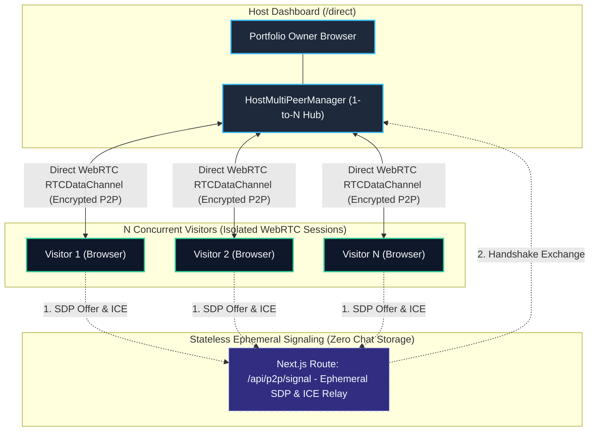
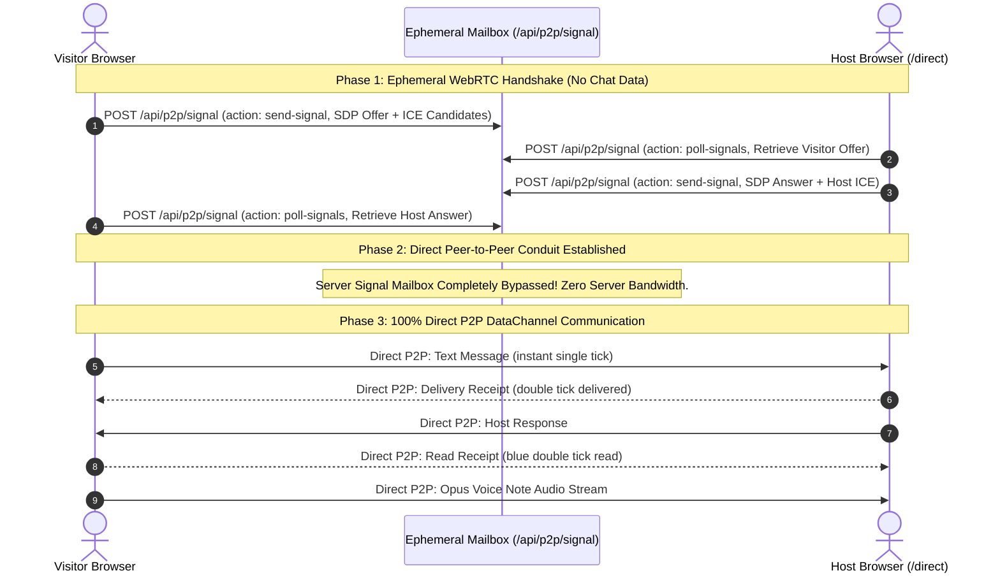

<div align="center">

# Portfolio OS

[](https://www.nomanali.online/)
[](https://nextjs.org/)
[](https://www.typescriptlang.org/)
[](LICENSE)
[](https://github.com/nomi181472/portfolio-os/stargazers)

<p align="center">
  <strong>The open-source Personal Operating System & Portfolio Framework for Systems Engineers, Architects, and Researchers.</strong>
</p>

<p align="center">
  <em>A content-driven architecture where work cannot fit on a single flat resume. Edit one JSON file or use the built-in browser editor. Pre-rendered, ultra-fast, and search-engine optimized.</em>
</p>

🔗 **[Explore Live Demo → www.nomanali.online](https://www.nomanali.online/)**

</div>

---

## 🧭 Overview & Target Highlights

Most developer portfolio templates are simple single-page landing sites. **Portfolio OS** is an engineering artifact: a connected **knowledge graph** that models real-world engineering depth across **16 structured collections** — with bidirectional linking, an in-browser zero-dependency visual editor, full-text fuzzy command palette search (`⌘/Ctrl + K`), privacy-first analytics, and serverless **peer-to-peer (P2P) direct messaging**.

> [!NOTE]
> **Universal Open-Source Framework**: Portfolio OS is designed for **any software engineer, solutions architect, or technical researcher**. The profile, projects, and metrics currently bundled inside `content/portfolio.json` serve as a complete **production-grade sample portfolio demonstration**. Simply fork the repo, replace `content/portfolio.json` with your data (or edit via `/edit`), run `npm run index`, and deploy your own personalized OS!

- **Author / Architect:** [Noman Ali](https://www.nomanali.online/) (Software Engineer & Solutions Architect)
- **Primary Live Deployment:** [https://www.nomanali.online](https://www.nomanali.online)
- **Repository:** [https://github.com/nomi181472/portfolio-os](https://github.com/nomi181472/portfolio-os)
- **Tech Stack:** Next.js 15 (App Router, Server Components), TypeScript, WebRTC DataChannels, SQLite (FTS5), OKLCH Design Tokens, Zod, KaTeX, Schema.org JSON-LD.

---

## ✨ Key Capabilities & System Features

| Feature | Description | Search & Performance Benefit |
|---|---|---|
| 🗂️ **16 Structured Collections** | Products, projects, research, publications, skills, experience, awards, certifications, education, leadership, and startup ventures | Individual crawlable canonical URLs for every single project, publication, and skill |
| 🔗 **Bidirectional Knowledge Graph** | Cross-linked entities: skills link to products, products link to research. An interactive SVG schematic renders connections visually | Deep internal link architecture boosts Google search indexing and contextual entity ranking |
| 📡 **P2P Direct Communication** | Browser-to-browser WebRTC `RTCDataChannel` chat connecting visitors directly to the host without third-party messaging servers | Real-time private communication with zero recurring SaaS server costs |
| 🎙️ **Voice Notes & Waveforms** | Touch/click hold-to-record voice audio messaging with hands-free lock, discard gesture, and waveform playback (1x / 1.5x / 2x speed) | Interactive, high-fidelity audio engagement across mobile, tablet, and desktop |
| ✓✓ **Delivery & Read Receipts** | WhatsApp-style live receipt ticks: Single tick (✓ sent), double tick (✓✓ delivered), blue double tick (✓✓ read) | Full state transparency across isolated visitor chatrooms |
| 🔑 **Responsive Host Console** | Dedicated `/direct` dashboard supporting N concurrent visitor rooms with mobile drill-down navigation and tablet split-views | Dynamic SQLite authentication with zero hardcoded credentials |
| ✏️ **Built-in Visual Editor** | Browser-based GUI with live preview, undo/redo history, JSON diff, and export (`⌘/Ctrl + E`) | Zero CMS or database required — pure static content agility |
| 🔍 **Full-Text Command Menu** | Instant `⌘/Ctrl + K` fuzzy search over all entities, summaries, and technical tags | Instant client navigation without heavy page overhead |
| 📊 **Zero-Cookie Analytics** | Self-hosted, privacy-first analytics dashboard with HyperLogLog unique visitors, scroll depth, and geographic breakdowns | Zero external tracking scripts — 100/100 Google Lighthouse performance score |
| 🎨 **OKLCH Mathematical Theming** | Dynamic styling derived from two mathematical color seeds. Supports Obsidian Dark, Warm Sepia, Paper Light, and High Contrast | Coherent visual hierarchy across dark/light modes and accessibility standards |
| ⚡ **SEO & Rich Structured Data** | Built-in Schema.org `Person`, `WebSite`, `Article`, `ScholarlyArticle`, and `ItemList` JSON-LD graphs | Instant rich snippets, Google Knowledge Graph eligibility, and social preview cards |

---

## 🚀 Quickstart — Deploy Yours in 3 Steps

### 1. Clone & Install

```bash
git clone https://github.com/nomi181472/portfolio-os.git my-portfolio
cd my-portfolio
npm install
npm run dev
```

Open [http://localhost:3000](http://localhost:3000) to see the system running locally.

### 2. Customize Content (`content/portfolio.json`)

Everything about your experience, achievements, and projects lives in a single validated file: **`content/portfolio.json`**.

You can edit it in two ways:

- **Method A — Visual In-Browser Editor (Recommended)**:
  1. Go to [http://localhost:3000/edit](http://localhost:3000/edit) or press `⌘/Ctrl + E`.
  2. Visually update your information, add projects, and tweak skills.
  3. Hit **Export** and replace `content/portfolio.json`.
- **Method B — Direct JSON Modification**:
  1. Open `content/portfolio.json` in your favorite IDE.
  2. Validate changes with:
     ```bash
     npm run validate
     ```
  3. Re-index search and vector embeddings:
     ```bash
     npm run index
     ```

> **Automatic Index Freshness & Git Pre-Commit Hook**:
> - `npm run build` automatically checks the modification timestamp of `content/portfolio.json` against `portfolio.db` and `public/data/vectors.json`. If `content/portfolio.json` is modified, it runs re-indexing instead of serving stale results.
> - To automatically re-index and stage updated index files whenever you commit changes to `portfolio.json`, install the pre-commit hook:
>   ```bash
>   npm run setup:hooks
>   ```

### 3. Configure Site Metadata & Deploy

Update `config/portfolio.config.ts`:

```ts
export const portfolioConfig = {
  site: {
    url: 'https://your-domain.com',       // Your canonical production domain
    title: 'Your Name — Your Discipline', // Browser title & social card header
    description: 'Concise summary for Google search results and OpenGraph snippets.',
    locale: 'en',
  },
  theme: {
    primary: 'oklch(0.12 0.005 260)',     // Substrate background
    secondary: 'oklch(0.98 0.002 260)',   // Contrast signal
    defaultAppearance: 'sepia',          // 'dark' | 'light' | 'system' | 'sepia'
  },
};
```

Deploy to [Vercel](https://vercel.com) or any cloud provider:

```bash
npm run build
npx vercel
```

---

## 📡 Peer-to-Peer (P2P) Direct Communication & Voice Messaging

Portfolio OS includes a native **serverless peer-to-peer (P2P) direct communication system** connecting prospective clients, recruiters, and collaborators directly with the portfolio owner:

### 1. Zero-Backend Architecture: How It Works Without a Central Server

Traditional chat applications require costly backend infrastructure: persistent WebSocket servers, Pub/Sub brokers (Redis), and centralized messaging databases (PostgreSQL, Supabase, Firebase).

Portfolio OS achieves **100% Backendless Communication** using native browser **WebRTC DataChannels (`RTCDataChannel`)**:

1. **Zero Database / Zero Message Storage**: Messages, read receipts, and voice audio are never written to any database or disk. All communication flows in-memory directly between the visitor and host browsers via encrypted DTLS/SCTP tunnels.
2. **Stateless Ephemeral Signaling Mailbox**: The Next.js API route (`/api/p2p/signal`) functions exclusively as an ephemeral exchange mailbox for WebRTC session negotiation (SDP Offer/Answer and ICE candidates). Payloads live in an in-memory sliding buffer with a 60-second TTL and zero persistence.
3. **Instant Direct Data Conduit**: The moment WebRTC ICE negotiation succeeds, the server is completely bypassed. All subsequent messages, typing states, and binary voice notes flow directly browser-to-browser.

---

### 2. 1-to-N Host and N-Visitors Architecture Topology

The host dashboard at `/direct` is an event-driven multiplexer (`HostMultiPeerManager`) capable of maintaining simultaneous, isolated WebRTC sessions with **N concurrent visitors** ($V_1, V_2, \dots, V_n$):



#### Key Multi-Visitor Properties:
- **Strict Session Isolation**: Every visitor is assigned an ephemeral session identifier (`visitorId`). Host responses are addressed cryptographically and routed strictly to that specific visitor's `RTCDataChannel`.
- **Zero Cross-Talk**: Visitors cannot see or discover other active visitors; each visitor only ever connects to the host.
- **Dynamic Multi-Room Switcher**: On `/direct`, the owner sees individual visitor cards with unread badges, live presence indicators, and activity timestamps.

---

### 3. Backendless Signaling Handshake & Direct Data Flow



---

### 4. Interactive Voice Notes & Real-time Receipts
- **Touch / Click Hold-to-Record**: Press and hold to record voice messages; slide up or tap lock for hands-free recording; slide left or tap discard to abort.
- **Waveform Audio Scrubber**: Interactive audio waveform player with scrub bar, elapsed timer, and 1x / 1.5x / 2x speed toggles.
- **Live Receipts**: Full state visibility across browsers:
  - Single tick (✓ `sent`): Transmitted by the client browser.
  - Double tick (✓✓ `delivered`): Received by the counterparty's browser.
  - Blue double tick (✓✓ `read`): Counterparty has focused and viewed the chatroom.

### 5. Dynamic Data-Driven Configuration (Zero Hardcoding)
- **Channel ID Derivation**: The deterministic channel ID is dynamically derived from SQLite (`portfolio.db` -> `getEntity('profile')` email) or `content/portfolio.json` using SHA-256 (`deriveChannelId`).
- **Owner Authentication**: Protected by owner secret passphrase HMAC signature verification (`generateHostProof`).
- **Access Anywhere**: Open `/direct` on any mobile phone, tablet, or desktop to monitor presence and chat live.

---

## 🏗️ Architecture & Directory Layout

### System Pipeline Architecture (Unicode Schematic)

```text
╭─────────────────────────────────────────────────────────────────────────────╮
│  ◈ LAYER 01 : SINGLE SOURCE OF TRUTH                                        │
│  ┌────────────────────────┐            ┌────────────────────────────────┐   │
│  │ content/portfolio.json │ ◄────────► │ In-Browser Visual Editor (⌘+E) │   │
│  │ (Zero Hardcoded Data)  │  Live Sync │ (Instant JSON Diff & Preview)  │   │
│  └────────────────────────┘            └────────────────────────────────┘   │
╰──────────────────────────────────────┬──────────────────────────────────────╯
                                       │
                                       │  ⚡ [ npm run index: Graph & Embeddings ]
                                       ▼
╭─────────────────────────────────────────────────────────────────────────────╮
│  ◈ LAYER 02 : RELATIONAL STORAGE & SEMANTIC VECTOR INDEX                    │
│  ┌───────────────────────────────────┐ ┌──────────────────────────────────┐ │
│  │  SQLite Engine (portfolio.db)     │ │  Vector Store (vectors.json)     │ │
│  │  • FTS5 Tokenized Full-Text Search│ │  • 384D / 64D Dense Embeddings   │ │
│  │  • 16 Interconnected Collections  │ │  • Bidirectional Graph Topology  │ │
│  └───────────────────────────────────┘ └──────────────────────────────────┘ │
╰───────────────────┬───────────────────────────────────────┬─────────────────╯
                    │                                       │
                    ▼                                       ▼
╭─────────────────────────────────────────────────────────────────────────────╮
│  ◈ LAYER 03 : PORTFOLIO OS RUNTIME (Next.js 15 App Router)                  │
│  • Draggable Multi-Window Desktop Shell  • ⌘+K Instant Fuzzy Command Menu   │
│  • OKLCH Mathematical Color Palettes     • Zero-Cookie Privacy Telemetry    │
╰───────────────────┬───────────────────────────────────────┬─────────────────╯
                    │                                       │
                    ├─── Dual Independent Client Engines ───┤
                    │                                       │
                    ▼                                       ▼
╭──────────────────────────────────────╮ ╭────────────────────────────────────╮
│  ◈ 100% LOCAL IN-BROWSER AI ENGINE   │ │  ◈ SERVERLESS P2P WEBRTC CONDUIT   │
│  [ ONNX Runtime Web • WebGPU / WASM ]│ │  [ DTLS-SCTP E2E Encrypted Tunnel ]│
├──────────────────────────────────────┤ ├────────────────────────────────────┤
│  • Qwen 2.5-0.5B / SmolLM2-360M      │ │  • Zero Central Messaging Servers  │
│  • Grounded RAG (Zero Hallucination) │ │  • Push-to-Talk Voice Notes (Opus) │
│  • Clickable UI Cards & Deep Routes  │ │  • Live Read Receipts (✓, ✓✓ Blue) │
│  • $0.00 Server Token Cost Forever   │ │  • PWA Standalone App for Host     │
╰──────────────────────────────────────╯ ╰────────────────────────────────────╯
```

### Directory Structure

```text
portfolio-os/
├── content/
│   └── portfolio.json          # Your primary content database (single source of truth)
├── config/
│   └── portfolio.config.ts     # Domain, metadata, colors, and feature flags
├── app/                        # Next.js 15 App Router (Static pre-rendered routes)
│   ├── page.tsx                # Surface / Depth 0 home view & schematic map
│   ├── [category]/             # Category indices (/products, /research, /skills, etc.)
│   ├── [category]/[slug]/      # Pre-rendered entity detail views
│   ├── direct/                 # P2P Multi-visitor Host Dashboard
│   ├── api/p2p/                # WebRTC signal exchange & SQLite channel discovery
│   ├── sitemap.ts              # Automated XML sitemap generation with dynamic lastmod
│   ├── robots.ts               # Automated robots.txt rules
│   ├── manifest.ts             # Web App Manifest & PWA specifications
│   ├── edit/                   # Browser-based visual editor
│   ├── analytics/              # Self-hosted private analytics dashboard
│   └── opengraph-image.tsx     # Dynamic server-side Open Graph social preview cards
├── components/                 # Reusable UI & layout modules
│   ├── p2p/                    # DirectChatPanel, VoiceRecorder, VoiceMessagePlayer
│   └── agent/                  # AI Assistant with embedded P2P mode
├── lib/                        # Schema validation, graph traversal, SEO & P2P engines
│   └── p2p/                    # WebRTC PeerClient, HostMultiPeerManager, crypto
└── styles/
    ├── tokens.css              # Mathematical OKLCH design system
    └── globals.css             # Performance-tuned layout styling
```

---

## 🔍 SEO & Machine Discoverability Specifications

Portfolio OS comes with production-grade technical SEO out-of-the-box:

1. **Structured Data (Schema.org / JSON-LD)**:
   - Emits interconnected `@graph` schema combining `Person`, `WebSite`, `CreativeWork`, `Role`, and `EducationalOrganization`.
   - Links the portfolio canonical entity directly to GitHub author profile and source repository (`codeRepository`).
2. **Metadata & OpenGraph**:
   - Comprehensive Twitter summary cards with dynamic 1200x630px canvas generation.
   - Clean self-referencing canonical URLs on every hub and detail page.
3. **Automated Search Engine Maps**:
   - Dynamic `/sitemap.xml` generated automatically from your content graph with legitimate content-derived `lastmod` dates.
   - Crawler directives in `/robots.txt` disallowing internal utility paths while maximizing search indexing efficiency.

---

## ⌨️ Command Palette & Keyboard Navigation

| Key Combination | Action |
|---|---|
| `⌘/Ctrl + K` | Trigger full-text command search across all collections |
| `⌘/Ctrl + E` | Open in-browser visual portfolio editor |
| `Esc` | Dismiss modals, search drawers, and active dialogs |
| `↑` / `↓` / `Enter` | Navigate and select search results without mouse |

---

## 📜 Available Development Commands

```bash
npm run dev          # Start local development server on port 3000
npm run index        # Rebuild SQLite FTS5 search index and vector embeddings
npm run build        # Build and statically pre-render all routes for production
npm start            # Run production server
npm run validate     # Validate content/portfolio.json against strict Zod schema
npm run typecheck    # Validate TypeScript type consistency across all files
npm test             # Execute test suites (schema, graph, search, analytics)
npm run setup:hooks  # Install git pre-commit hook to auto-index when portfolio.json changes
```

---

## 👤 Author & Maintainer

**Noman Ali**  
*Technical Lead*  
- Portfolio: [https://www.nomanali.online](https://www.nomanali.online)  
- GitHub: [@nomi181472](https://github.com/nomi181472)  
- LinkedIn: [linkedin.com/in/noman-a-70604a175](https://www.linkedin.com/in/noman-a-70604a175)  
- Google Scholar: [Noman Ali Citations](https://scholar.google.com/citations?user=SFLfK9oAAAAJ&hl=en)  

---

## 📄 License

This project is open-source and released under the [MIT License](LICENSE).
